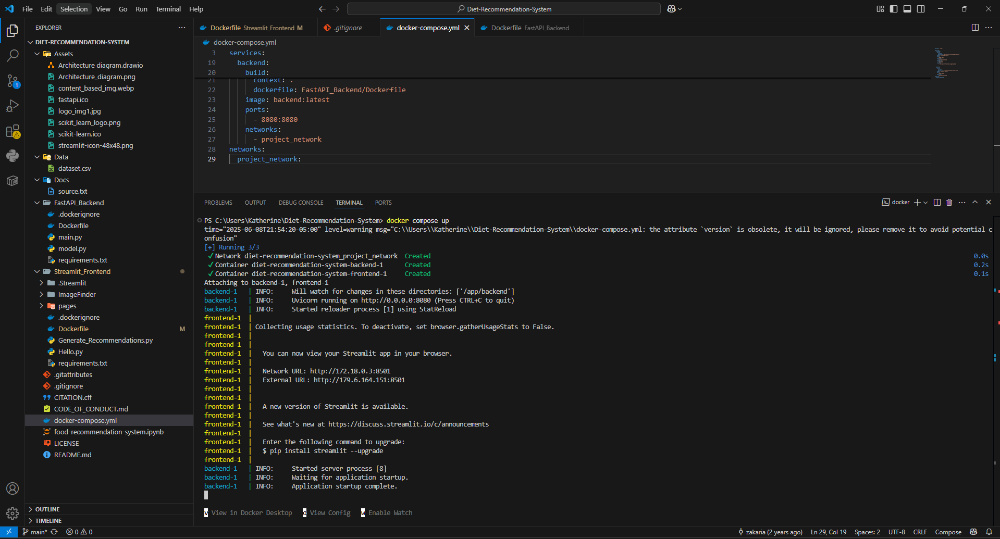
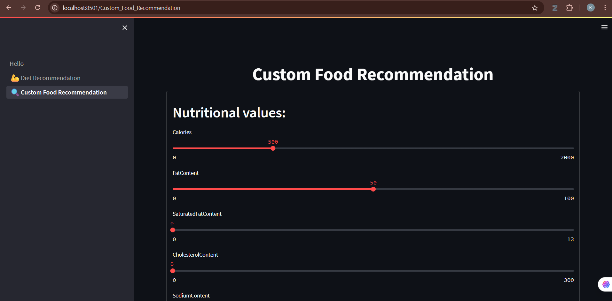

# NutriKAI 🍽️🤖

**NutriKAI** es una plataforma web inteligente para el monitoreo y recomendación personalizada de macronutrientes, impulsada por modelos de lenguaje natural (NLP) y aprendizaje automático. Está inspirada y basada parcialmente en el repositorio [MachineKe/Diet-Recommendation-System](https://github.com/zakaria-narjis/Diet-Recommendation-System), pero extendida con un enfoque más profundo en personalización, comprensión semántica del texto y alertas automáticas.

---

## 📑 Tabla de contenidos

- [ℹ️ Información general](#️-información-general)
- [📌 Diferencias clave respecto al repositorio base](#-diferencias-clave-respecto-al-repositorio-base)
- [⚙️ Tecnologías utilizadas](#️-tecnologías-utilizadas)
- [🐳 Ejecución del sistema con Docker](#-ejecución-del-sistema-con-docker)
- [📸 Evidencia de ejecución](#-evidencia-de-ejecución)
- [🪪 Licencia y créditos](#-licencia-y-créditos)

---

## ℹ️ Información general

### 📍 Proyecto base: [MachineKe/Diet-Recommendation-System](https://github.com/MachineKe/Diet-Recommendation-System)

Este repositorio desarrolla un sistema de recomendación de dietas basado en filtrado por contenido. Utiliza un modelo simple con algoritmos como `NearestNeighbors` y `cosine similarity` para recomendar alimentos según preferencias nutricionales básicas.

---

### 💡 ¿Qué propone NutriKAI?

NutriKAI amplía este enfoque básico para incluir:

- **Procesamiento de lenguaje natural (PLN)** con modelos como **BERT**, que permiten al usuario ingresar alimentos en lenguaje libre.
- **Reconocimiento automático de entidades alimenticias** (NER) para entender mejor lo que el usuario ha consumido.
- **Generación de alertas inteligentes** con modelos como **XGBoost**, en base al historial de consumo del usuario.
- **Recomendaciones personalizadas** adaptadas al perfil demográfico, historial nutricional y preferencias implícitas del usuario.
- Una interfaz moderna construida con **Next.js**, y visualización de progresos con gráficos dinámicos.
- Un enfoque más educativo y de asistencia diaria para mejorar la calidad alimenticia de manera sostenible.

---

## 📌 Diferencias clave respecto al repositorio base

| Característica                      | `Diet-Recommendation-System`                     | **NutriKAI (propuesto)**                                         |
|------------------------------------|---------------------------------------------------|------------------------------------------------------------------|
| Tipo de recomendación              | Filtrado por contenido (cosine similarity)        | Recomendaciones semánticas con embeddings y aprendizaje automático |
| Entrada del usuario                | Formulario con datos nutricionales                | Entrada en lenguaje natural (texto libre)                        |
| Procesamiento de texto             | No                                                  | **Sí** — con BERT y NER                                          |
| Alerta de deficiencias             | No                                                  | **Sí** — modelo predictivo (XGBoost)                             |
| Frontend                           | Streamlit                                           | **Next.js**                                                      |
| Bases de datos                     | Kaggle Food.com                                     | USDA, OpenFoodFacts, BERT Nutrition NER                         |

---

## ⚙️ Tecnologías utilizadas

- **FastAPI** – Backend para análisis nutricional.
- **Next.js** – Frontend dinámico.
- **Docker + Docker Compose** – Contenedores para desplegar la app.
- **BERT / NLP** – Reconocimiento y extracción de información alimentaria desde texto.
- **XGBoost** – Generación de alertas por desequilibrio.
- **PostgreSQL** – Gestión de datos de alimentos y usuarios.
- **Chart.js / D3.js** – Visualización de datos.

---

## 🐳 Ejecución del sistema con Docker

> Asegúrate de tener Docker y Docker Compose instalados.

1. Clona el repositorio:
```bash
git clone https://github.com/Katy-Bejar/nutrikai.git
cd nutrikai
```

2. Construye y levanta los servicios:
```bash
docker-compose up --build
```
3. Abre tu navegador en:
```bash
http://localhost:8501
```

---

## 📸 Evidencia de ejecución

✅ **1. Compilación con Docker (`docker-compose up`)**  
Demuestra que el sistema fue levantado correctamente y que los servicios fueron construidos sin errores.



✅ **2. Interfaz funcionando en el navegador**  
La plataforma web está activa en `http://localhost:8501` y lista para recibir entradas del usuario.



---


## 🪪 Licencia y créditos

Este proyecto ha sido desarrollado con fines académicos y de investigación en el marco de una tesis universitaria. Se ha basado e inspirado en el siguiente repositorio:

🔗 Repositorio base original: [MachineKe/Diet-Recommendation-System](https://github.com/MachineKe/Diet-Recommendation-System)

---


